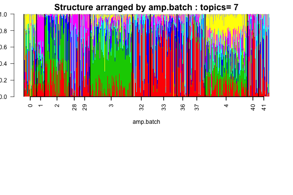
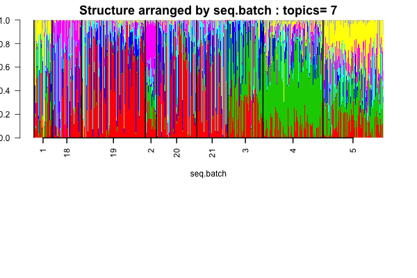

## Objective

We apply the topic model for clustering of single cells in the data due to Jaitin \emph{et al}. Check the [paper](http://science.sciencemag.org/content/343/6172/776). 


## Load pacakges

```{r}
library(CountClust)
library(Biobase)
```


## Data Preprocessing

```{r echo=TRUE, eval=TRUE}
# import raw data 
library(singleCellRNASeqMouseJaitinSpleen)
data(MouseJaitinSpleen)
counts <- exprs(MouseJaitinSpleen)
gene_names <- rownames(fData(MouseJaitinSpleen))
meta_data <- pData(MouseJaitinSpleen)
dim(counts)

# exclude ERCC genes 
ENSG_genes_index <- grep("ERCC", gene_names, invert = TRUE)
length(ENSG_genes_index)

# expression matrix without ENSG genes
counts_ensg <- counts[ENSG_genes_index, ]

head(meta_data)

# exclude wells more than 1 cell and with total UMI count > 600
# also include only CD11c+ cells
sum(as.numeric(meta_data$number_of_cells) ==1 &  
        meta_data$group_name =="CD11c+" & colSums(counts_ensg) > 600 )

## exclude ribosomal protein genes and ...
filter_genes <- c("M34473","abParts","M13680","Tmsb4x",
                    "S100a4","B2m","Atpase6","Rpl23","Rps18",
                    "Rpl13","Rps19","H2-Ab1","Rplp1","Rpl4",
                    "Rps26","EF437368") 
fcounts <- counts_ensg[ -match(filter_genes, rownames(counts_ensg)), ]
sample_counts <- colSums(fcounts)
sum(meta_data$number_of_cells==1 & meta_data$group_name=="CD11c+" & 
        sample_counts > 600 )

## create sample filtering index
filter_sample_index <- which(meta_data$number_of_cells == 1 & 
                             meta_data$group_name == "CD11c+" & 
                             sample_counts > 600)

## create a filtered dataset
counts_ensg_filtered <- counts_ensg[ , filter_sample_index]
meta_data_filtered <- meta_data[filter_sample_index, ]
```


## Topic model fit

We fit the topic on the filtered dataset (see above) for $7$ topics.

```{r echo=TRUE, eval=FALSE}
# transpose the count matrix from gene by sample to
# sample by gene, the default format of CountClust packge
# also the meta data matrix from sample by phenotpye to
# phenotype by sample
Topic_Clus <- StructureObj(data = t(counts_ensg_filtered), 
                     samp_metadata = t(data.frame(meta_data_filtered)),
                     nclus_vec = 7,
                     plot = FALSE,
                     tol = 0.01,
                     path_rds = "rdas/MouseJaitinSpleen-topicFit.rds")
```


## Structure Plot

```{r echo=TRUE, eval=FALSE}
topic_fit <- readRDS("../rdas/MouseJaitinSpleen-topicFit.rds")
str(topic_fit)
omega <- topic_fit[[1]]$omega


if(!dir.exists("../plots/jaitin-structure"))  {
    dir.create("../plots/jaitin-structure")
}

samp_metadata <- cbind.data.frame(
    seq.batch = meta_data_filtered[,"sequencing_batch"], 
    amp.batch = meta_data_filtered[,"amplification_batch"])


StructureObj_omega(omega, 
    samp_metadata = samp_metadata,  
    batch_lab = NULL,
    path="../plots/jaitin-figures",
    partition = c("TRUE","TRUE"),
    control=list(cex.axis=1))
```





