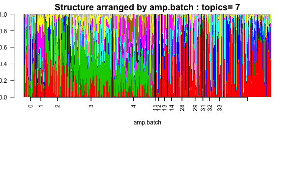

## Objective

We apply the topic model for clustering of single cells in the data due to Jaitin \emph{et al}. Check the [paper](http://science.sciencemag.org/content/343/6172/776). 


## Data Preprocessing

```{r echo=TRUE, eval=TRUE}
library(data.table)
Data=data.frame(fread("../external_data/Jaitin_Data/GSE54006_umitab.txt")); 
gene_names=as.matrix(Data[,1]);
Exp_details=read.table(file="../external_data/Jaitin_Data/jaitin_etal_experimental_design.txt",fill=T,header=T);

##########    extracting the ERCC  genes #########################

ERCC_genes_index=grep("ERCC",gene_names);

Data_non_ERCC=Data[-ERCC_genes_index,];  ###  this is our new Data

counts =t(as.matrix(Data_non_ERCC[,-1]))   ###  extracting only the mRNA counts data (numeric matrix)
dim(counts)

batch_well_ID=colnames(Data_non_ERCC)[-1]
bwlist=strsplit(batch_well_ID,"_");
index_ID = as.numeric(matrix(unlist(bwlist),nrow=2)[2,])

mm = match(index_ID,Exp_details[,1])
  Exp_details = Exp_details[mm,]
  dim(counts)
  dim(Exp_details)
  identical(Exp_details[,1],index_ID)
  totalcounts = rowSums(counts)

sum(Exp_details$number_of_cells==1 &  Exp_details$group_name=="CD11c+" & totalcounts > 600 )


filterlist=c("M34473","abParts","M13680","Tmsb4x","S100a4","B2m","Atpase6","Rpl23","Rps18","Rpl13","Rps19","H2-Ab1","Rplp1","Rpl4","Rps26","EF437368") 
fcounts = counts[,-match(filterlist,gene_names[-ERCC_genes_index])]
totalfcounts = rowSums(fcounts)
sum(Exp_details$number_of_cells==1 &  Exp_details$group_name=="CD11c+" & totalfcounts > 600 )

indices=which(Exp_details$number_of_cells==1 &  Exp_details$group_name=="CD11c+" & totalfcounts > 600);

```

## Topic model fit

We filter out the samples corresponding to the indices chosen above.  then we fit the topic model for $7$ topics.

```{r echo=TRUE, eval=FALSE}
fcounts_reduced=fcounts[match(indices,index_ID),];
Topic_Clus=topics(fcounts_reduced,7,kill=0,tol=0.005);
docweights=Topic_Clus$omega;
omega <- as.matrix(docweights)
```

## Structure Plot

```{r echo=TRUE, eval=TRUE}
omega <- as.matrix(read.table("../internal_data/jaitin_omega_7.txt"))
exp_labels <- match(indices,Exp_details$index);
Exp_details_reduced <- Exp_details[exp_labels,];

if(!dir.exists("../plots/jaitin_structure/")) dir.create("../plots/jaitin_structure/")

samp_metadata <- cbind.data.frame(Exp_details_reduced$sequencing_batch, Exp_details_reduced$amplification_batch);
colnames(samp_metadata) = c("seq.batch", "amp.batch");

library(CountClust)
obj <- StructureObj_omega(omega, samp_metadata = samp_metadata, batch_lab = NULL, path="../plots/jaitin_structure",partition = c("TRUE","TRUE"),
                          control=list(cex.axis=1));

```



